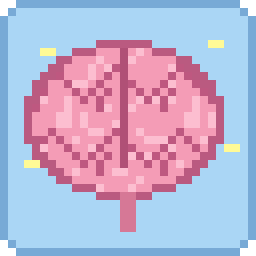

# Elduin's Head

Ever wanted to see inside my head? 🧠

Build a frame out of glowstone, the same shape as a Nether portal, and pour
a water bucket into it. The portal turns pink. Walk in and you end up inside
Elduin's head, a giant room with my brain floating in the middle and my eyes
as windows. Step into the portal in there and it takes you home to your bed.

Fabric, for Minecraft 1.21.11 and 26.2. Needs Fabric API. Put it on the server
and in your game.

Made by Elduin, with Claude.
